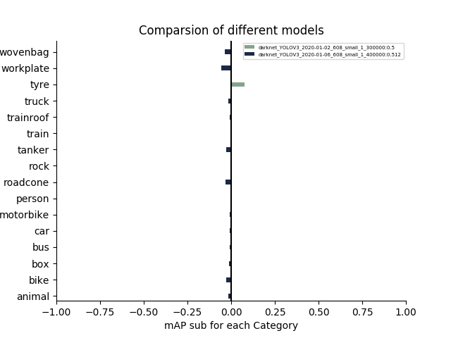
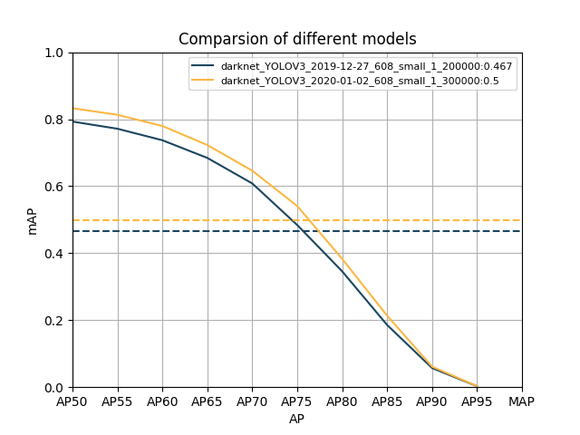
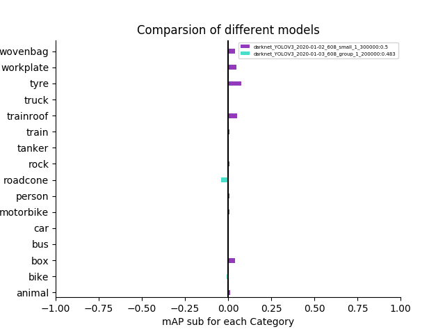

# 最新实验结果

# 目前最优anchor（2020.1）

## 9个anchor的情况：      
1、608：[(15,18),  (16,28), (28,28),(36,54), (38,35), (63,90), (113,173), (223,392), (381,467)]    
2、训练轮数：400000（每次训100000）    
3、学习率：[400,700,900,1000, 40000,65000,80000]，[0.0001,0.0002,0.0005,0.001, 0.0005,0.0001,0.00005]（调整轮数设置，学习率设置）    
4、batchsize：24       

测试分辨率：608       
   
    
   

     
      
    
    

实验结果：目前最好的MAP为0.512，total_loss已经降到142000，而且loss还有下降的趋势，可以接着尝试训练，进一步提高准确度。  

## 6个anchor的情况：     
1、608：[(12,20),  (17,43), (39,64),(50,126), (119,236), (349,419)]    
2、训练轮数：300000（每次训100000）    
3、学习率：[400,700,900,1000, 40000,65000,80000]，[0.0001,0.0002,0.0005,0.001, 0.0005,0.0001,0.00005]（调整轮数设置，学习率设置）    
4、batchsize：24       

测试分辨率：608      
   
    
   

     
      
    
    

实验结果：目前最好的MAP为0.492，total_loss已经降到142500，而且loss还有下降的趋势，可以接着尝试训练，进一步提高准确度。      

# anchor（2020.1）
1、608：[(15,18),  (16,28), (28,28),(36,54), (38,35), (63,90), (113,173), (223,392), (381,467)]    
2、训练轮数：300000（每次训100000）    
3、学习率：[400,700,900,1000, 40000,65000,80000]，[0.0001,0.0002,0.0005,0.001, 0.0005,0.0001,0.00005]（调整轮数设置，学习率设置）    
4、batchsize：24       

测试分辨率：608      
   
    
   

     
      
    
    

实验结果：目前最好的MAP为0.5，total_loss已经降到145000，而且loss还有下降的趋势，可以接着尝试训练，进一步提高准确度。               

测试分辨率：416         
   
     
    

实验结果：416测试时MAP为0.42，出现了相对下滑。      

# anchor（2019.12）

1、608：[(15,18),  (16,28), (28,28),(36,54), (38,35), (63,90), (113,173), (223,392), (381,467)]    
2、训练轮数：200000（先训100000，再训100000）    
3、学习率：[400,700,900,1000, 40000,65000,80000]，[0.0001,0.0002,0.0005,0.001, 0.0005,0.0001,0.00005]（调整轮数设置，学习率设置）   
4、batchsize：24      

测试分辨率：608     
   
    
   

     
      
    
   

实验结果：目前最好的MAP为0.467，total_loss已经降到150000     

测试分辨率：416       
   
    
  

测试分辨率：544     
   
    
  

测试分辨率：672      
   
     
   

|anchor|训练分辨率|测试分辨率|MAP| 
|:-----:|:-----:|:-----:|:-----:| 
|608_small_1| 608| 416| 0.364|  
|608_small_1| 608| 544| 0.446|  
|608_small_1| 608| 608| 0.467|   
|608_small_1| 608| 672| 0.477|    

# 针对person类的anchor

1、608_person：[(8,20),  (13,51), (19,31),(26,75), (38,149), (61,85), (91,231), (183,384), (400,453)]     
2、训练轮数：100000    
3、学习率：[400,700,900,1000, 40000,65000,80000]，[0.0001,0.0002,0.0005,0.001, 0.0005,0.0001,0.00005]（调整轮数设置，学习率设置）   
4、batchsize：24   

测试分辨率：608   
   
    
   

     
      
    
  

实验结果：在较少的训练轮数下MAP达到了0.453，total_loss降到极小值后出现了反弹，停留在155000，距离最好的情况还有一定距离 

# 其他6个anchor的情况

1、608，group：[(12,20),  (17,43), (39,64),(50,126), (119,236), (349,419)]     
2、训练轮数：100000     
3、学习率：[400,700,900,1000, 40000,65000,80000]，[0.0001,0.0002,0.0005,0.001, 0.0005,0.0001,0.00005]（调整轮数设置，学习率设置）    
4、batchsize：24    

测试分辨率：608    
   
    
   

     
      
    
   

实验结果：MAP为0.433，低于最好的0.467，但相同情况下的9个anchor的MAP为0.411，显然anchor减少对MAP有提高      

继续训练100000轮    

   
    
   

     
      
    
   

实验结果：MAP为0.483，低于最好的0.512，但是接近最好的标准了，而且loss还有继续下降的趋势。     

1、608，all：[(19,42),  (56,105), (95,246),(190,407), (256,167), (432,449)]      
2、训练轮数：100000     
3、学习率：[400,700,900,1000, 40000,65000,80000]，[0.0001,0.0002,0.0005,0.001, 0.0005,0.0001,0.00005]（调整轮数设置，学习率设置）    
4、batchsize：24      

测试分辨率：608     
   
    
   

     
      
    
   

实验结果：MAP为0.421，低于最好的0.467。     

