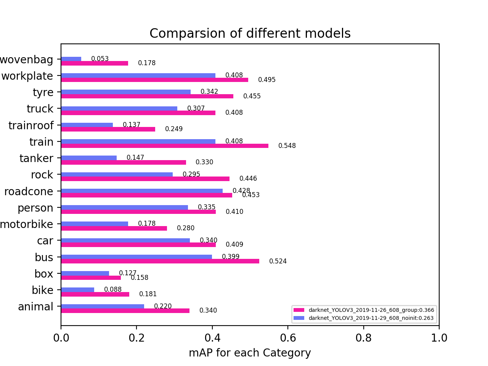
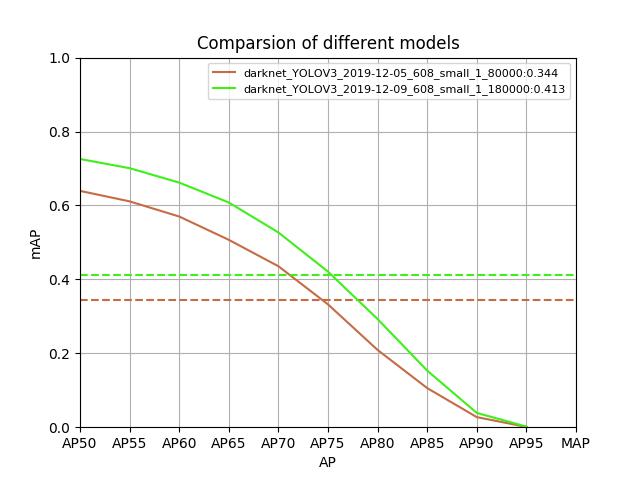
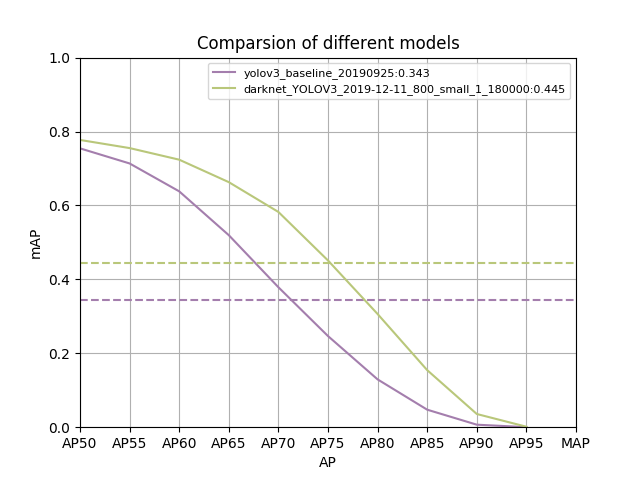

# 实验结果 

# 目前最优的设计实验结果

1、608、noratio：[(16,34),  (37,78),  (59,185), (105,96), (109,341), (164,203), (222,433), (399,235),(453,485)]   
2、训练轮数：100000   
3、batchsize：24（目前环境下最大设置）

 
 
 

实验结果：MAP为0.35，略优于baseline的0.343，但是如折线图所示，在阈值0.65前，实验结果明显差于baseline，这是什么原因，待查？？？   

# 1、按照大中小设计anchor尺寸

1、608、group：[(9,20),  (14,47), (24,26),(29,67), (41,137), (73,70), (106,210), (202,373), (436,429)]    
2、训练轮数：100000    
3、batchsize：24（目前环境下最大设置） 

  
  
  

实验结果：MAP为0.366，目前最好，但是在阈值较小时没有baseline效果好    

# 2、调整minibatchsize     

1、608、group：[(9,20),  (14,47), (24,26),(29,67), (41,137), (73,70), (106,210), (202,373), (436,429)]      
2、训练轮数：100000      
3、batchsize：24（目前环境下最大设置）   
4、mini_batchsize从6调整到8    

   
   
   

实验结果：MAP为0.369，目前最好，相对提高了0.003    

# 3、不加载预训练模型   

1、608、group：[(9,20),  (14,47), (24,26),(29,67), (41,137), (73,70), (106,210), (202,373), (436,429)]       
2、训练轮数：100000       
3、batchsize：24（目前环境下最大设置）    
4、不加载预训练模型     

    
    
    

实验结果：MAP为0.263，出现了巨大的滑坡，所以使用预训练模型在很大程度上提高了模型的精度。但猜测通过延长训练轮数可以有效解决精度损失的问题    

# 3、按照目标的类别聚类  
聚类规则：    
1、按照该类别目标总数是否大于2500个分别聚类，大于2500按照规则2聚类，否则分到大类里（所谓大类包含tanker,box,wovenbag,workplate,tyre），按照规则3聚类    
2、按照大中小物体再次分类，每个子类大于此类数量的10%才对其聚类成3类     
3、按照大中小物体再次分类，每个子类聚类成3类    
4、对所有类别聚类成9类    

1、608：[(19,26),  (34,55), (69,86),(101,210), (174,94), (212,344), (273,177), (395,286), (462,485)]       
2、训练轮数：100000        
3、batchsize：24（目前环境下最大设置）    

    
    
  

实验结果：MAP为0.326，效果一般，主要原因是样本不平衡问题普遍存在，即使在相同类别内大中小目标的数量差异也可能存在，对anchor聚类产生影响，从而影响对小目标的检测精度     

# 4、对特殊目标检测
类别：tanker,box,wovenbag,workplate,tyre   

1、608：[(15,18),  (16,28), (28,28),(36,54), (38,35), (63,90), (113,173), (223,392), (381,467)]        
2、训练轮数：80000         
3、batchsize：24（目前环境下最大设置）    

    
    
  

2、608：[(15,17),  (16,27), (28,28),(35,38), (45,57), (63,112), (112,171), (221,285), (381,467)]         
2、训练轮数：80000         
3、batchsize：24（目前环境下最大设置）    

    
    
   

实验结果：相同规则下，只因为最后聚类结果不同使anchor存在一些差别，但最后的map相差很大，所以精准的anchor设置是十分必要的     

1、608：[(15,18),  (16,28), (28,28),(36,54), (38,35), (63,90), (113,173), (223,392), (381,467)]        
2、训练轮数：80000，180000            
3、batchsize：24（目前环境下最大设置）    

    
    
 

实验结果：通过延长训练轮数，针对小目标改进的anchor的map达到了0.413，目前表现最好的设置     

baseline：[(10,13),  (16,30),  (33,23), (30,61), (62,45), (59,119), (116,90), (156,198), (373,326)]（基准，c++）   

    
    
 

实验结果：相对于baseline的anchor设置，针对小目标改进的anchor的map为0.413，远高于baseline的0.343，远高于608-group的0.366。但是，在阈值小于0.56的情况下检测效果略差于baseline，以及在wovenbag和box上检测效果略差于baseline   

# 5、测试时图像输入分辨率对MAP影响

1、608：[(15,18),  (16,28), (28,28),(36,54), (38,35), (63,90), (113,173), (223,392), (381,467)]         
2、训练轮数：80000，180000             
3、batchsize：24（目前环境下最大设置）     
4、训练时图像输入分辨率608     

第一种：测试时图像输入分辨率416      
   


第二种：测试时图像输入分辨率608      
   
   

第三种：测试时图像输入分辨率672      

  

第四种：测试时图像输入分辨率800       
   


第五种：测试时图像输入分辨率960       
    


|anchor|训练分辨率|测试分辨率|MAP|
|:-----:|:-----:|:-----:|:-----:|
|608_small_1| 608| 416| 0.327|
|608_small_1| 608| 544| 0.413|
|608_small_1| 608| 608| 0.431|   
|608_small_1| 608| 672| 0.445| 
|608_small_1| 608| 800| 0.445| 
|608_small_1| 608| 960| 0.437|

实验结果，无论是训练还是测试，增大图像分辨率会提高模型精度，表现为MAP的提高，但是当分辨率增加到一定程度，MAP就不会增加了，而且会增加推理时间。    

# 结论 

Yolov3模型精度提高：   
```
1、调大minibatchsize     
调大minibatchsize可以略微提高mAP，但是会增加显存，暂时不建议      

2、加载预训练模型    
加载预训练模型可以有效地提高mAP，减少训练轮数，缩短训练时间      

3、合适的anchor设置    
对一些特殊场景下的测试，合适的anchor尺寸会明显提高mAP，特别是针对特定的物体，如tanker,box,wovenbag,workplate,tyre等   

4、分辨率    
若训练分辨率为608，测试分辨率为672时，mAP达到最大，所以合适的调整分辨率会提高模型准确度，经验是测试分辨率比训练分辨率略提高10%左右时效果最佳      

```

