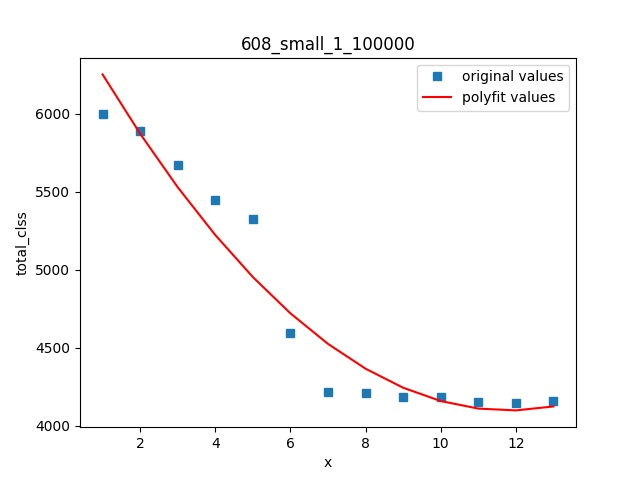

# loss分析

## 目前最优anchor

1、608：[(15,18),  (16,28), (28,28),(36,54), (38,35), (63,90), (113,173), (223,392), (381,467)]          
2、训练轮数：180000              
3、batchsize：24     

    
    
 
 

实验结果说明：该anchor共进行了180000次迭代，其中前80000次的loss结果没有保留，这里只保留了后100000次的loss数据。    
1、从图1 loss图中可以得到在训练进行12次eopch后loss趋于平稳，模型收敛。其中第5个epoch和第6个epoch之间loss会有一个迅速的下降，原因是训练时在此处进行了学习率的调整导致模型又进一步收敛。     
2、从图2 classloss图、图3 coordinateloss图、图4 confidenceloss图也可以得到相同的结论，区别在于classloss和confidenceloss已经趋于平稳但是coordinateloss还有下降趋势，说明class和confidence的任务比coordinate任务容易，或者说通过延长训练可以回归得到更好的框框，更分类和置信度的到天花板了，但因为实际应用中更在意检测的准不准，所以没必要增加训练轮数     


## 目前最新的anchor（12.18）  

1、[(11,20),  (15,46), (27,25),(33,62), (55,109), (90,56), (131,162), (225,292), (442,430)]    
2、训练轮数：100000             
3、batchsize：24   

    
    
 
 

实验结果说明：从图1 loss图、图2 classloss图、图3 coordinateloss图、图4 confidenceloss图中可以看出第8个epoch后模型就趋于稳定了，此时应该及时调整学习率，否则即使继续训练，意义不大   


# 结论   
Yolov3模型精度提高：  
```
1、及时调整学习率
在训练进行了相应的epoch时，模型已趋于稳定，此时应该及时调整学习率，模型才能得到相应的提高，否则之后的训练将无意义,或者当评价指标达到训练的预期阈值时及时地终止训练，避免浪费时间，两者都可以加速训练，节省不必要的时间，提高工作效率        

注意：darkent与优图的loss的量级是一致的   

```