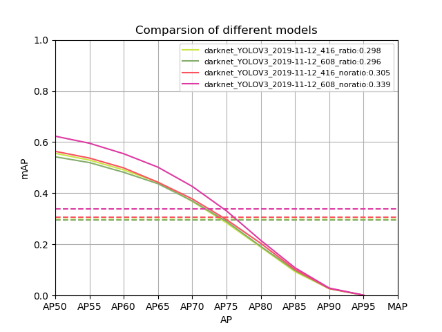

# anchor改进实验结果  

实验结果对比的指标统一为：MAP    

实验中，  
max_batches: 50200  
batch_size: 24  
mini_batch_size: 6   
其余所有超参都设置为相同，利用控制变量法只记录abchor尺寸对实验结果影响   
注：  
1、406/608的意思是anchor聚类时图片的输入尺寸resize成406或608  
2、ratio/noratio的意思是anchor聚类时图片的输入尺寸是否保持宽高比，noratio意味着图片输入会有形变  
3、没有特别备注表示都是在腾讯优图平台上训练的  
   
## 1、原生anchor与baseline对比  

baseline：[(10,13),  (16,30),  (33,23), (30,61), (62,45), (59,119), (116,90), (156,198), (373,326)]（基准，c）  
原生anchor：[(10,13),  (16,30),  (33,23), (30,61), (62,45), (59,119), (116,90), (156,198), (373,326)] （腾讯优图）  


  

可以看出实验结果明显差于baseline，暂时不能确定具体的原因    
猜测可能原因：训练轮数太少，目前正在试验，观察性能是否有提升   

## 2、输入图像尺寸416或608和保持ratio或不保持ratio下聚类生成anchor实验结果  

416、ratio:[(11,16),  (27,37),  (85,55), (40,87), (75,146), (123,217), (201,277), (220,112), (330,235)]   
608、ratio：[(16,23),  (40,55),  (60,129), (123,76), (106,237), (191,163), (211,352), (420,411), (424,209)]   
416、noratio：[(11,23),  (25,54),  (40,127), (72,65), (75,234), (112,139), (152,297), (273,161), (311,332)]   
608、noratio：[(16,34),  (37,78),  (59,185), (72,65), (105,96), (109,341), (164,203), (222,433), (399,235)]   

   
   
 
实验结果：输入图像尺寸为608，不保持ratio下聚类获得的anchor的实验结果明显优于其他结果，精度上存在10%的差距。同时，他们的精度都高于原生的精度。  

可能原因：使用从数据集中聚类得到的anchor尺寸比原生的anchor更接近数据集的真实情况，因此训练时在达到相同的精度的情况下，所需要的训练轮数更少，相当于加速了学习，所以在相同训练轮数下，使用从数据集中聚类得到的anchor尺寸可以达到更高的精度，而使用原生达到相同的精度可能需要更多的训练轮数，目前正在实验进行验证   

## 3、608_noratio anchor与baseline对比   
 
baseline：[(10,13),  (16,30),  (33,23), (30,61), (62,45), (59,119), (116,90), (156,198), (373,326)]（基准，c++）   
608、noratio：[(16,34),  (37,78),  (59,185), (72,65), (105,96), (109,341), (164,203), (222,433), (399,235)]    

 
 
  
 
实验结果：输入图像尺寸为608，不保持ratio下聚类获得的anchor的实验结果与baseline的实验结果在伯仲之间，在折线图中，随着阈值的增加，聚类获得的anchor的实验结果的精度衰减明显慢于baseline   
 
## 4、增加训练轮数的影响    
 
原生anchor：[(10,13),  (16,30),  (33,23), (30,61), (62,45), (59,119), (116,90), (156,198), (373,326)]    
在50200轮训练情况下map为0.261      
在70000+轮训练情况下map为0.359      

 
 
  

实验结果：验证了实验1和2中假设，即使anchor的尺寸设置与训练数据集不一致，也可以通过延长训练轮数来实现精度的提高    

## 5、误调整一个anchor的尺寸的影响 

608、right：[(16,34),  (37,78),  (59,185), (105,96), (109,341), (164,203), (222,433), (399,235),(453,485)]  
608、noratio：[(16,34),  (37,78),  (59,185), (72,65), (105,96), (109,341), (164,203), (222,433), (399,235)]  

 
 
  

实验结果：在实验时，608、noratio中第四anchor尺寸（72,65）漏了，没有调整，导致相应位置的anchor都向后移动一位形成了608、right中的anchor设计。奇怪的是，相同条件下，608、noratio获得了比608、noratio更高的map。  
可能原因：因为低层特征图是通过高层特征图和backbone融合得到的，所以低层特征图中必然包含高层特征图中的信息。因此，在低层特征图中安排高层特征图中的anchor可以提高准确率，目前正在进行实验验证。  

## 6、anchor形状的影响

baseline：[(10,13),  (16,30),  (33,23), (30,61), (62,45), (59,119), (116,90), (156,198), (373,326)]（基准，c++）   
608、square：[(23,23),  (54,54), (100,100),(104,104), (182,182), (306,306), (193,193), (310,310), (469,469)]（训练100000轮）  

 
 
  
 
实验结果：验证实验2中假设，使用正方形anchor，通过增加训练轮数，一样可以达到baseline的map，验证了如果不想通过对数据集聚类得到anchor的尺寸，那么可以通过延长训练轮数来实现精度的提高    

##  7、anchor中某个anchor位置调整的影响  

416、ratio、cross：[(11,16),  (27,37), (40,87),(85,55), (75,146), (123,217), (201,277), (220,112), (330,235)]（batch size 12）   
416、ratio：[(11,16),  (27,37),  (85,55), (40,87), (75,146), (123,217), (201,277), (220,112), (330,235)]     

 
 
 

实验结果：在这两个anchor设置中唯一的区别是第三个anchor和第四个anchor的位置出现了调换，导致anchor会出现在不同的特征层作为先验，但是目前看来错误的416、ratio获得的map为0.298，而正确的416、ratio、cross为0.247,anchor位置的错误调换出现了精度的提高。当然416、ratio、cross的batch size为12，而416、ratio的batch size为24，目前正在实验排除是不是batch size的影响导致精度提高   

补充实验：    
batchsize都调成12时，    
416_ratio_cross：[(11,16),  (27,37), (40,87),(85,55), (75,146), (123,217), (201,277), (220,112), (330,235)]     
416_ratio_cross_1：[(11,16),  (27,37),  (85,55), (40,87), (75,146), (123,217), (201,277), (220,112), (330,235)]     

 
 
 

实验结果：在相同条件下，anchor位置错误的调整会导致精度的极具降低，而较大的batchsize即使anchor设置不合理对模型精度的提高也有所帮助，同时验证了实验5的猜想错误       
可能原因：模型在向后传播时，较大的batchsize，意味着参与训练的数据集的分布更稳定，从而可以提高梯度的稳定性，提高模型的精度，而较小的batchsize，数据集的分布更多变，梯度可能波动性太大从而影响模型精度    

# 结论    

最后实验结果见[lastresults](lastresults.md)   
```
Yolov3模型精度提高：  
1、anchor设置    
合理的anchor尺寸可以减少训练轮数，提高模型精度  
   
2、增加训练轮数      
即使anchor尺寸的设计不合理，可以通过增加训练轮数来提高模型的精度     

3、增大batchsize    
增加batchsize，提高了参与训练的数据集的分布的稳定性，从而提高梯度的稳定性，提高模型精度  
```