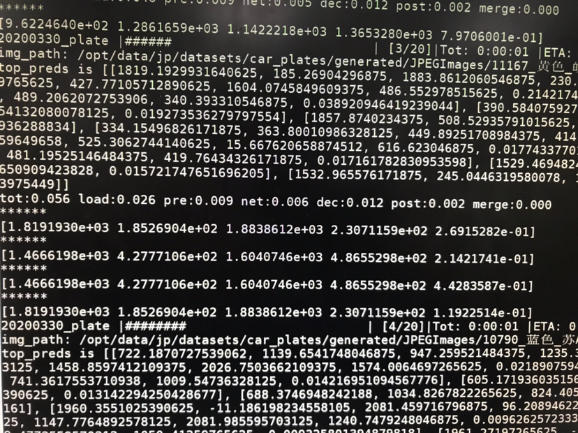
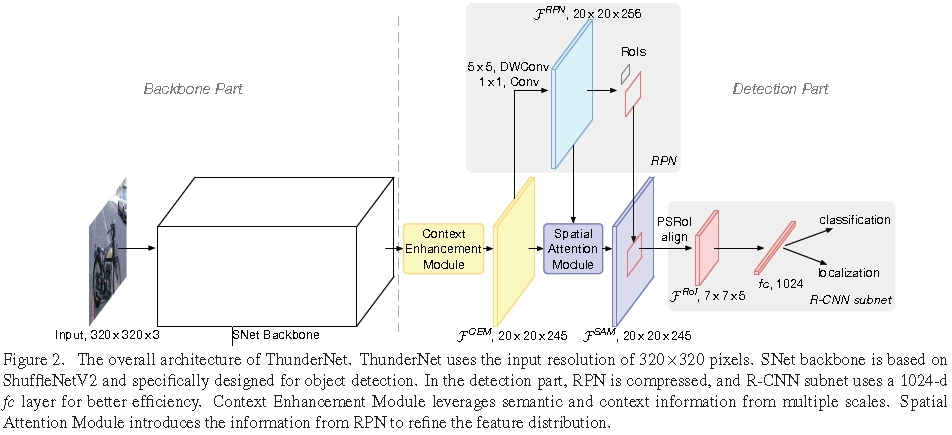
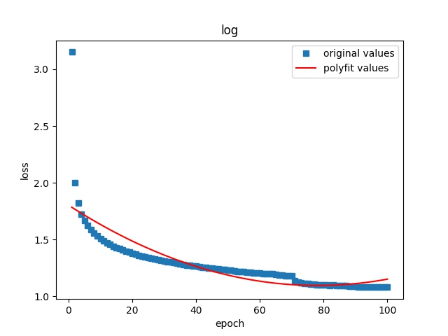
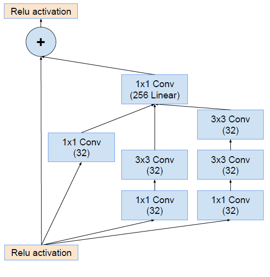
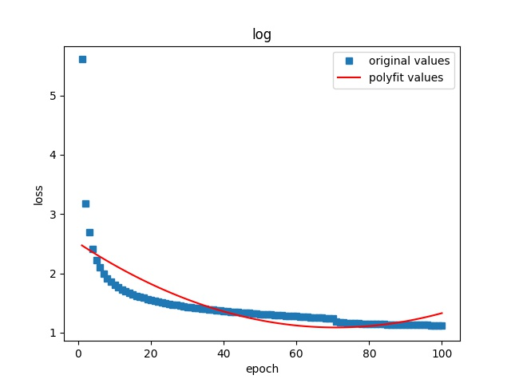

# centernet网络结构优化

1、reg和wh分支合并   
2、resnet融合FPN    
3、GoogleNet中Inception结构移植到Centernet    
4、bottleneck替换Resnet18中的basicblock   
5、resnet升级为resnext    
6、轻量级网络mobilenetv2，v3及变体移植到Centernet   
7、wh loss优化为集成坐标信息与IOU或GIOU信息的FocalLoss   
8、xception、shufflenet、densenet移植到Centernet    

注意：实验结果普遍高于论文结果可能的原因是：在训练数据集中除了voc、coco和object365等公开数据集外还加入了自己制作的数据集，这些数据集场景高度单一而且在训练集中占据很大的比例

## CenterNet baseline    

在16类数据集上训练实验结果：    

|网络结构|epochs|原论文MAP|原论文FPS|MAP|单帧速度（s）|
|:-----:|:-----:|:-----:|:-----:|:-----:|:-----:|
|resnet_18|67|0.281 |142|0.444|0.056|
|DLA_34| 100|0.374|52|0.549|0.042|
|Hourglass_104|50|0.451|1.4|0.589|0.07|  

# 优化

## 1、reg和wh分支合并
在plate训练时遇到centernet检测效果不好的情况：     

      

如图1所示，检测目标是同一个框，但是置信度有很多个，所以有理由怀疑坐标和置信度是相互独立的，所以尝试在反卷积之后的位置对reg和wh两个分支进行合并，做一次信息交互，然后在得到两个分支各自结果。类似于thundernet中的注意力模块（如图2所示），无论如何命名，什么语义增强模块，什么什么模块等，最后的操作都是加2层卷积层或者4层卷积层，除了一些特殊的结构可能会产生一些特殊的效果，如FPN的不同层的特征融合，hourglass的沙漏型网络，HRnet的直角三角形的网络。     

      

plate实验结果：     
基础网络：resnet_18    
IOU：0.5    

|类型|MAP|
|:-----:|:-----:|
|原生|0.541| 
|合并后| 0.786|

在16类数据集上训练实验结果：   
基础网络：resnet_18    

|类型|训练时长|MAP|IOU=0.5|单帧速度（s）|
|:-----:|:-----:|:-----:|:-----:|:-----:|
|原生|50epoch |0.394|0.722| 0.035|
|合并后|50epoch| 0.408|0.733|0.035|
|原生|100epoch|0.458|0.770| 0.035|
|合并后|100epoch| 0.456|0.771|0.035|

训练50 epoch时，合并后的IOU=0.5和总的map为0.733和0.408，都高于原生的；训练100 epoch时，合并后的IOU=0.5的map为0.771，高于原生，总的map为0.456，略低于原生，所以应用时需要具体问题具体分析。     

## 2、resnet+FPN   
描述：在centernet三个反卷积层加入FPN结构，或者可以理解为一个更大范围内的残差结构      

在16类数据集上训练实验结果：      
基础网络：resnet_18      
训练时长：100 epoch    

|类型|MAP|IOU=0.5|单帧速度（s）|
|:-----:|:-----:|:-----:|:-----:|
|原生|0.458|0.770| 0.035|
|合并后| 0.456|0.771|0.035|
|+FPN|0.480|0.803|0.05|   
|+FPN+wh_focalloss|0.477|0.795|0.058|

resnet+FPN的loss图：     

   

## 3、Inception  Block    
描述：将block设置为googlenet V4中的inception结构，如下图：         

    

在16类数据集上训练实验结果：      
基础网络：inception_24      
训练时长：100 epoch    

|类型|MAP|IOU=0.5|单帧速度（s）|
|:-----:|:-----:|:-----:|:-----:|
|inception|0.463|0.769| 0.055|
|inception+FPN|0.467|0.796| 0.037|

Inception的loss图：      

   

## 4、bottleneck block
描述：将block设置为bottleneck block结构,数量设置为[2,2,2,2]:

在16类数据集上训练实验结果：      
基础网络：resnet_26      
训练时长：100 epoch      

|类型|MAP|IOU=0.5|单帧速度（s）|
|:-----:|:-----:|:-----:|:-----:|
|原生|0.458|0.770| 0.035|
|resnet_26|0.460|0.773|0.117|
|resnet_26+FPN|0.470|0.784|0.067|     
|resnet_26+FPN+wh_focalloss|0.492|0.797|0.071|      

## 5、resnext     
描述：resnet升级版resnext;加入iouloss，与坐标回归loss形成focalloss           

在16类数据集上训练实验结果：        
基础网络：resnext_18       
训练时长：100 epoch       

|类型|MAP|IOU=0.5|单帧速度（s）|
|:-----:|:-----:|:-----:|:-----:|
|resnext_18+FPN+focalloss(1X)|0.416|0.724|0.067|  
|resnext_18+FPN+focalloss(2X)|0.439|0.790|0.079|   

注：1X指Bottleneck中expansion为1，2X指Bottleneck中expansion为2

## 6、xception
基础网络：xception_v1:去除了exitFlow结构     
         xception_v2:728 channel改512     
         xception_v3:原生 728 channel     
训练时长：100 epoch       

|类型|参数|MAP|IOU=0.5|单帧速度(s)|
|:-----:|:-----:|:-----:|:-----:|:-----:|
|xception_v1+FPN+focalloss||0.298|0.616|0.056|  
|xception_v2+FPN+focalloss|125.37M|0.453|0.803|0.096|  
|xception_v2+FPN+focalloss|184.67M|0.487|0.811|0.041|

## 7、shufflenet
基础网络：shufflenet  
训练时长：100 epoch       

|类型|MAP|IOU=0.5|单帧速度（s）|
|:-----:|:-----:|:-----:|:-----:|
|shufflenet+FPN+focalloss|0.337|0.667|0.098|  

## 8、densenet
基础网络：densenet  
训练时长：100 epoch       

|类型|MAP|IOU=0.5|单帧速度（s）|
|:-----:|:-----:|:-----:|:-----:|
|densenet+FPN+focalloss|45.9|0.505|0.819 |0.056|  

## 9、mobilenet       
   
变化之处：    
Mobilenet v2为原生，没有FPN     
Mobilenet v2为原生，有FPN
Mobilenet v2_1去掉了倒数第三层和最后一层，同时增加了通道数，目的是保持模型复杂度，保持模型的表达能力          
Mobilenet v2_1和Mobile v3都增加了FPN层，提高模型准确度        

|类型|MAP|IOU=0.5|单帧速度（s）|
|:-----:|:-----:|:-----:|:-----:|
|Mobilenet v2|0.372|0.678|0.062|
|Mobilenet v2+FPN|0.395|0.733 |0.071|
|Mobilenet v2_1|0.429|0.772| 0.073|
|Mobilenet V3|0.343|0.653| 0.081|  

# C++端测试结果：    
条件：2080       

|网络|自有数据集MAP|通过网络时间|处理总时间| 
|:-----:|:-----:|:-----:|:-----:|
|Resnet_18|	0.458|5.39ms|17.30ms| 
|Resnet_26|	0.460|7.29ms|17.63ms| 
|Inception+FPN|0.467|6.43ms|17.25ms|    

移动端：   

|网络|自有数据集MAP|通过网络时间|处理总时间| 
|:-----:|:-----:|:-----:|:-----:|
|Mobilenet v2|0.372|4.43ms|15.53ms|
|Mobilenet v2+FPN|0.395| 4.31ms|16.10ms|
|Mobilenet v2_1|0.429|4.46ms|16.37ms| 

# centernet训练中GPU利用率不高，训练慢  

解决方案：      
这是因为cpu操作太多，GPU等待数据，如果num_workers>0,开始多线程,那么torch.utils.data.DataLoader会报错DataLoader worker (pid 2287) is killed by signal: Killed. 可能原因是pytorch训练过程太费内存了，导致服务器内存不够，触发OS的保护机制，直接杀死了进程，目前的解决方法是创建docker时，加入--shm-size选项，例如：docker run --runtime=nvidia -e NVIDIA_VISIBLE_DEVICES=2,3 --shm-size 8G  -it --rm dev:v1 /bin/bash可以解决目前问题      

时间对比：restnet-18     

|卡数线程数|MAP训练1个epoch时间|GPU使用率|
|:-----:|:-----:|:-----:|
|双卡单线程|约3小时|长时间为0%|
|双卡16线程（有FPN结构）|约15分钟|保持在80%以上|
|单卡8线程（原生的结构）|约20分钟|保持在90%以上|
|单卡8线程（reg和wh分支合并）|约25分钟|保持在90%以上|

建议：遇到GPU使用率低需要开启多线程时报错要具体问题具体分析，同时提高训练速度是一定会消耗资源的，提高线程数会提高GPU使用率，降低训练时间，但是如何在不影响服务器上其他任务的前提下平衡好线程数和GPU使用率需要自己权衡      

