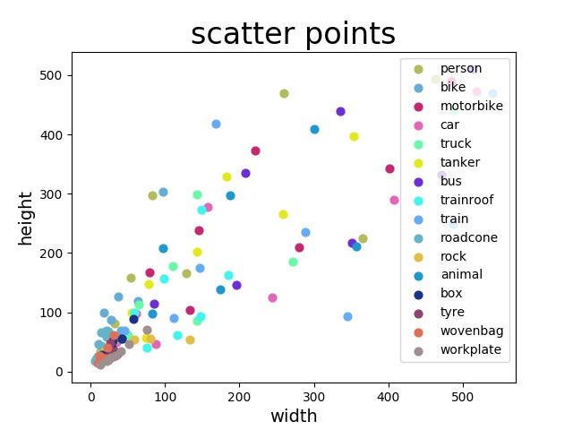

# 自有数据集anchor分层聚类结果

## 按照大中小尺寸  
对自有数据集中的大中小尺寸的目标分别聚类出3个anchor的结果：  
条件：  
1、图片输入基准：608*608   
2、不考虑图片resize中的变形问题    
第一次：   

|total|width|height|aspectratio|
|:-----:|:-----:|:-----:|:-----:|
|anchor1| 8.848| 19.471| 0.454|
|anchor2| 13.773| 47.169| 0.292|
|anchor3|24.423|25.531|0.957|
|anchor4|28.968| 66.585| 0.435|
|anchor5|41.394|136.607| 0.303|
|anchor6|72.63|70.075|1.036|
|anchor7|106.089|209.975|0.505|
|anchor8|201.761|373.161|0.541|
|anchor9|435.909| 428.629| 1.017|  

第二次：   

|total|width|height|aspectratio|
|:-----:|:-----:|:-----:|:-----:|
|anchor1|8.848|19.471|0.454|
|anchor2|13.774|47.168|0.292|
|anchor3| 24.423|25.529|0.957|
|anchor4|28.968|66.586|0.435|
|anchor5|41.395|136.612|0.303|
|anchor6|72.63|70.075|1.036|
|anchor7|106.089|209.975|0.505|
|anchor8|201.761|373.161|0.541|
|anchor9|435.909|428.629|1.017|    

可以看出两次的聚类结果十分接近，说明分层聚类得到的anchor结果很稳定     

## 按照目标类别     
对自有数据集中目标按照类别分别聚类出3个anchor的结果：   
条件：   
1、图片输入基准：608*608    
2、不考虑图片resize中的变形问题    

先对每个类别的anchor尺寸聚成9类，再将得到的结果再聚成9类 

第一次实验：  
anchors可视化图：  

    

结果：  

|total|width|height|aspectratio|
|:-----:|:-----:|:-----:|:-----:|
|anchor1| 68.796| 86.099| 0.799|
|anchor2| 462.229| 485.218| 0.953|
|anchor3| 18.751| 25.816| 0.726|
|anchor4| 33.667| 55.423| 0.607|
|anchor5| 272.892| 177.135| 1.541|
|anchor6| 395.168| 285.801| 1.383|
|anchor7| 101.408| 201.443| 0.503|
|anchor8| 211.85| 344.165| 0.616|
|anchor9| 173.658| 93.515| 1.857|  

第二次实验：  
anchors可视化图：  

     

结果：    

|total|width|height|aspectratio|
|:-----:|:-----:|:-----:|:-----:|
|anchor1| 158.074| 318.986| 0.496|
|anchor2| 33.254| 61.649| 0.539|
|anchor3| 306.702| 196.593| 1.56|
|anchor4| 420.863| 424.956| 0.99|
|anchor5| 130.982| 81.845| 1.6|
|anchor6| 28.927| 29.786| 0.971|
|anchor7| 131.624| 174.668| 0.754|
|anchor8| 14.228| 23.975| 0.593|
|anchor9| 66.578| 100.603| 0.662|

两次实验结果可以看出聚类结果不稳定，可能原因是每个类别的数量差异过大，如表1所示，从而造成第一次聚类数量少的目标聚类结果不稳定，而第二次聚类的时候对每个类别都等同对待.总之，单个类别的内部的大中小目标都存在类别不平衡问题。         

## 按照目标数量
表1：   

|class|number|small|medium|large|
|:-----:|:-----:|:-----:|:-----:|:-----:|
|person| 538958| 125605| 192598| 220755|
|bike| 7542| 1408| 5615| 519|
|motorbike| 16261| 1358| 4912| 9991|
|car |149650 |46713 |65926 |37011|
|truck| 35201| 3616| 13986| 17599|
|tanker| 1513| 20| 461| 1032|
|bus |15100 |715 |3609 |10776
|trainroof |4369 |460 |2553| 1356|
|train |15629 |159| 2583| 12887|
|roadcone| 26813| 16971 |9841 |1|
|rock |4673 |1382| 3248 |43|
|animal |31386| 6217 |10621 |14548|
|box| 2285| 1516| 769| 0|
|tyre |957| 687| 270 |0|
|wovenbag |2115 |1926| 189| 0|
|workplate| 2115 |1118| 997| 0|

### 规则1
聚类规则：   
1、按照该类别目标总数是否大于2500个分别聚类，大于2500按照规则2聚类，否则分到大类里（所谓大类包含tanker,box,wovenbag,workplate,tyre），按照规则3聚类   
2、按照大中小物体再次分类，每个子类大于此类数量的10%才对其聚类成3类    
3、按照大中小物体再次分类，每个子类聚类成3类   
4、对所有类别聚类成9类    

第一次结果：  

|total|width|height|aspectratio|
|:-----:|:-----:|:-----:|:-----:|
|anchor1| 238.172| 309.109| 0.771|
|anchor2| 447.667| 431.71| 1.037|
|anchor3| 16.604| 50.412| 0.329|
|anchor4| 52.809| 109.749| 0.481|
|anchor5| 11.59| 21.955| 0.528|
|anchor6| 28.028| 24.233| 1.157|
|anchor7| 97.813| 57.721| 1.695|
|anchor8| 137.942| 171.867| 0.803|
|anchor9| 36.301| 59.0| 0.615|

第二次结果：  

|total|width|height|aspectratio|
|:-----:|:-----:|:-----:|:-----:|
|anchor1| 28.257| 29.104| 0.971|
|anchor2| 478.844| 431.986| 1.108|
|anchor3| 54.423| 107.438| 0.507|
|anchor4| 418.097| 429.72| 0.973|
|anchor5| 216.184| 288.697| 0.749|
|anchor6| 92.602| 57.559| 1.609|
|anchor7| 28.639| 61.174| 0.468|
|anchor8| 11.618| 28.294| 0.411|
|anchor9| 142.684| 161.548| 0.883|

两次实验结果可以看出聚类结果不稳定。    
在此基础上改变聚类规则中的4为：对所有类别按照大中小分成3类分别聚类结果：   

|total|width|height|
|:-----:|:-----:|:-----:|
|anchor1| 11| 20| 
|anchor2| 15| 46| 
|anchor3| 27| 25| 
|anchor4| 33| 62| 
|anchor5| 55| 109| 
|anchor6| 90| 56| 
|anchor7| 131| 162| 
|anchor8|225| 292| 
|anchor9| 442| 430| 

### 规则2
对tanker,box,wovenbag,workplate,tyre五个类别形成的大类聚类结果：   

第一次结果：   

|total|width|height|aspectratio|
|:-----:|:-----:|:-----:|:-----:|
|allanchor1| 15.024| 17.776| 0.845|
|allanchor2| 28.305| 27.856| 1.016|
|allanchor3| 16.166| 27.645| 0.585|
|allanchor1| 37.944| 34.807| 1.09|
|allanchor2| 63.297| 89.621| 0.706|
|allanchor3| 35.642| 53.637| 0.665|
|allanchor1| 222.601| 286.392| 0.777|
|allanchor2| 381.387| 466.699| 0.817|
|allanchor3| 113.974| 173.005| 0.659|

第二次结果：  

|total|width|height|aspectratio|
|:-----:|:-----:|:-----:|:-----:|
|allanchor1| 27.928| 28.231| 0.989|
|allanchor2| 15.101| 17.488| 0.863|
|allanchor3| 15.705| 26.602| 0.59|
|allanchor1| 63.437| 111.649| 0.568|
|allanchor2| 45.32| 56.693| 0.799|
|allanchor3| 35.267| 38.136| 0.925|
|allanchor1| 380.902| 466.558| 0.816|
|allanchor2| 220.876| 284.73| 0.776|
|allanchor3| 112.788| 171.299| 0.658|

两次实验结果可以看出聚类结果不稳定。  

### 规则3
聚类规则：   
1、按照该类别目标总数是否大于2500个分别聚类，大于2500按照规则2聚类，否则分到大类里（所谓大类包含box,wovenbag,workplate,tyre），按照规则3聚类     
2、按照大中小物体再次分类，如果大目标的子类的数量占该类数量的比例小于50%，则把该子类归入总体的大目标的子类中       
3、按照大中小物体再次分类，把大类的小和中型目标子类归入总体的小和中型目标的子类中       
4、在总体的大中小目标的子类中分别聚为3类，总共为9类          

|total|width|height|aspectratio|
|:-----:|:-----:|:-----:|:-----:|
|allanchor1| 27.928| 28.231| 0.989|
|allanchor2| 15.101| 17.488| 0.863|
|allanchor3| 15.705| 26.602| 0.59|
|allanchor1| 35.267| 38.136| 0.925|
|allanchor2| 63.437| 111.649| 0.568|
|allanchor3| 45.32| 56.693| 0.799|
|allanchor1| 189.977| 291.08| 0.653|
|allanchor2| 130.354| 151.167| 0.862|
|allanchor3| 422.363| 408.838| 1.033|  

### 规则4
聚类规则：   
small=['bike','motorbike','truck','tanker','bus','trainroof','train','rock','box','wovenbag','workplate','tyre']    
medium=['bike','motorbike','tanker','bus','trainroof','train','rock','box','wovenbag','workplate','tyre']    
large=['bike','motorbike','truck','tanker','bus','trainroof','train','roadcone','rock','animal']   
小目标聚类的样本来自small列表     
中目标聚类的样本来自medium列表    
大目标聚类的样本来自large列表     
分别对以上三个子类聚类，分别得到3个子类的3个anchor尺寸    

分辨率：608      

|total|width|height|aspectratio|
|:-----:|:-----:|:-----:|:-----:|
|allanchor1| 16.588| 43.849| 0.378|
|allanchor2| 14.097| 20.395| 0.691|
|allanchor3| 29.255| 25.287| 1.157|
|allanchor1| 48.011| 114.462| 0.419|
|allanchor2| 92.13| 58.468| 1.576|
|allanchor3| 35.094| 56.329| 0.623|
|allanchor1| 470.161| 428.497| 1.097|
|allanchor2| 136.916| 175.673| 0.779|
|allanchor3| 273.219| 301.169| 0.907|  

分辨率：416      

|total|width|height|aspectratio|
|:-----:|:-----:|:-----:|:-----:|
|allanchor1| 27.781| 22.171| 1.253|
|allanchor2| 17.417| 40.105| 0.434|
|allanchor3| 11.304| 16.919| 0.668|
|allanchor1| 34.366| 54.506| 0.63|
|allanchor2| 94.817| 50.587| 1.874|
|allanchor3| 54.03| 104.184| 0.519|
|allanchor1| 108.534| 177.034| 0.613|
|allanchor2| 296.038| 302.037| 0.98|
|allanchor3| 233.642| 149.214| 1.566|
  
|total|width|height|aspectratio|
|:-----:|:-----:|:-----:|:-----:|
|anchor1| 17.417| 40.105| 0.434|
|anchor2| 11.304| 16.919| 0.668|
|anchor3| 27.781| 22.171| 1.253|
|anchor1| 54.04| 104.179| 0.519|
|anchor2| 94.804| 50.58| 1.874|
|anchor3| 34.358| 54.521| 0.63|
|anchor1| 136.122| 139.569| 0.975|
|anchor2| 320.913| 283.614| 1.132|
|anchor3| 165.785| 249.919| 0.663|

# 总之，样本不平衡问题普遍存在，即使在相同类别内大中小目标的数量差异也可能存在，对anchor聚类产生影响，从而影响对小目标的检测精度     

# 自有数据集K的选择问题    

    

通过肘部法则可以得到，k大于6时，折线图的斜率明显变缓，所以k是转折点     

分层聚类结果：    

|total|width|height|aspectratio|
|:-----:|:-----:|:-----:|:-----:|
|allanchor1| 12.441| 20.051| 0.62|
|allanchor2| 17.485| 42.58| 0.411|
|allanchor1| 39.043| 63.892| 0.611|
|allanchor2| 49.628| 126.236| 0.393|
|allanchor1| 348.734| 419.426| 0.831|
|allanchor2| 118.938| 235.522| 0.505|

|total|width|height|aspectratio|
|:-----:|:-----:|:-----:|:-----:|
|allanchor1| 12.441| 20.051| 0.62|
|allanchor2| 17.485| 42.58| 0.411|
|allanchor1| 63.422| 101.177| 0.627|
|allanchor2| 30.453| 77.041| 0.395|
|allanchor1| 348.728| 419.404| 0.831|
|allanchor2| 118.927| 235.523| 0.505|

注：中型目标所在层有2种可能结果   

全体聚类结果：    

|total|width|height|aspectratio|
|:-----:|:-----:|:-----:|:-----:|
|anchor1| 256.137| 167.473| 1.529|
|anchor2| 95.204| 245.793| 0.387|
|anchor3| 56.218| 104.696| 0.537|
|anchor4| 19.453| 41.717| 0.466|
|anchor5| 432.054| 448.662| 0.963|
|anchor6| 190.476| 406.586| 0.468|

# 单独类person聚类结果
对person类按照大中小目标分类成3类，对每个子类聚类成3类，结果如下：   

|total|width|height|aspectratio|
|:-----:|:-----:|:-----:|:-----:|
|allanchor1| 19.472| 31.142| 0.625|
|allanchor2| 7.629| 20.153| 0.379|
|allanchor3| 12.502| 50.665| 0.247|
|allanchor1| 61.783| 85.27| 0.725|
|allanchor2| 38.528| 148.609| 0.259|
|allanchor3| 26.385| 75.2| 0.351|
|allanchor1| 90.812| 230.693| 0.394|
|allanchor2| 400.623| 453.406| 0.884|
|allanchor3| 182.915| 383.624| 0.477|   

实验结果：从表中可以看出这个anchor尺寸与对自有数据集中的大中小尺寸的目标分别聚类出3个anchor的结果极其相似，这说明因为person类数量远远大于其他类数量总和，所以对总体的anchor的影响是支配地位的     

