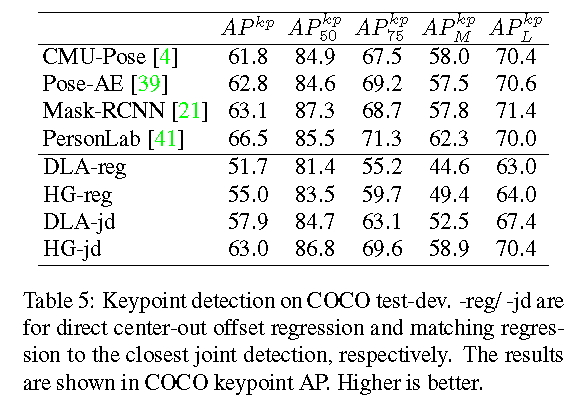

# centernet

论文：Objects as Points    
作者：Xingyi Zhou  Dequan Wang Philipp Kr¨ahenb¨uhl   

概述:通过关键点估计去找中心点，回归所有其他目标性质，例如尺寸，3D位置，定位甚至是姿势。CenterNet基于中心点的方法，与其他基于边界框的检测器，是端到端的可微分，更简单的，更快的甚至更准确    

算法思想：直接将输入图片喂给全卷积网络，然后产生一张热图。在热图中最大值点要与中心点一致。在每个最大值点的图片特征中预测目标边界框的高和宽。  

centernet接近于基于anchor的一步检测方法，中心点可以看成一个单一的形状不可知的anchor（图3）。然而，有几个重要的区别：  
1、centernet仅仅基于位置设置anchor，而不是box重叠部分。没有对前景和背景分类的人为设置的阈值       
2、每个目标只有一个正anchor，因此就不需要NMS。只是简单地在关键点热图中抽取位置的最大值。   
3、centernet相对于传统的目标检测（输出步长16）使用了更大的输出分辨率（输出步长4）。这就消除了多个anchors的需求。  

    

算法细节见论文第三和第四部分   
 
实验结果：    
速度与精度对比：    
   

与其他算法的对比实验：    
 

消融实验：   
   

关键点检测结果：    

附：  
[卷积神经网络的网络结构——Hourglass](https://blog.csdn.net/u013841196/article/details/81048237)   
[Deep Layer Aggregation](https://blog.csdn.net/u012193416/article/details/88658460)   