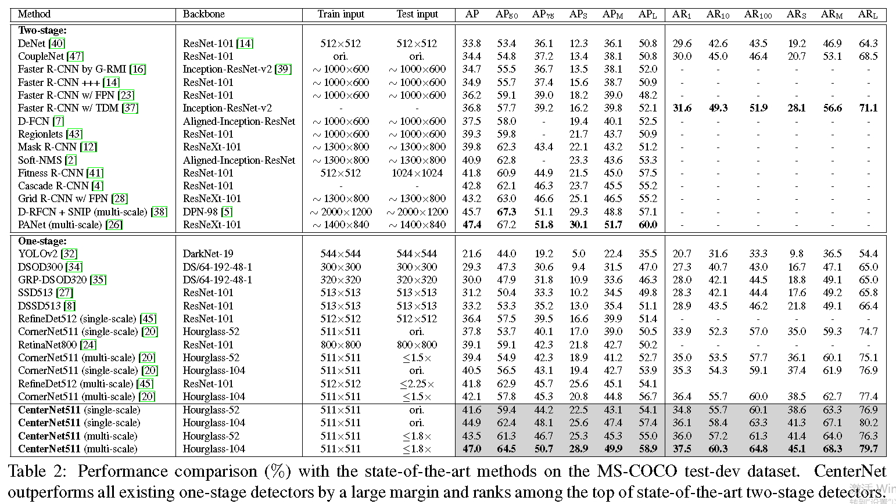

# centernet

论文：CenterNet: Keypoint Triplets for Object Detection    
作者：Kaiwen Duan，Song Bai，Lingxi Xie，Honggang Qi，Qingming Huang，Qi Tian  

概述：在cornernet的基础上，增加了cascade corner pooling和center pooling,cascade corner pooling通过左上角和右下角去丰富信息，center pooling提供更多中心区域可识别的信息。总之，通过三个关键点去检测而不是一对点   
在介绍中，第一段总结了anchor-based方法的缺点，第二段总结了cornernet的缺点，然后提出了基于Cornernet的centernet 
ideal的直觉：if a predicted bounding box has a high IoU with the groundtruth box, then the probability that the center keypoint in its
central region is predicted as the same class is high, and vice versa. 
意思：在推理环节，在一组角关键点提出候选框后，通过检查相同类别的中心关键点是否落入了中心区域来确定候选框是否真正包含目标   

## 主干
### 动机
cornernet思想:cornernet产生两个热图:左上角的一个热图和底部右下角的一个热图。热图表示不同类别的关键点的位置，并为每个关键点分配一个置信度分数。此外，它还预测了每个角的嵌入和一组偏移量。嵌入用来确定两个角是否来自同一个对象。偏移量学会重新映射角落从热图到输入图像。为了生成对象边界框，从热图中分别根据分数选择左上角和右下角。然后计算一对角的嵌入向量的距离，确定这对角是否属于同一物体。如果距离小于阈值，则生成一个对象边界框。边界框被分配一个信心分数，它等于角对的平均分数。  

   

图1为cornernet的错误发现率，可能原因是cornernet没能看见边界框内的区域，所以centernet要探索边界框内的视觉模式。centernet是一个一步检测法，但是部分继承了RoI pooling的功能。该方法仅仅关注中心的信息，但是代价很小。   

### 网络框架 
 
  

流程：  
(1) select top-k center keypoints according to their scores;    
(2) use the corresponding offsets to remap these center keypoints to the input image;   
(3) define a central region for each bounding box and check if the
central region contains center keypoints. Note that the class
labels of the checked center keypoints should be same as
that of the bounding box;   
(4) if a center keypoint is detected in the central region, we will preserve the bounding box. The score of the bounding box will be replaced by the average scores of the three points, i.e., the top-left corner, the bottom-right corner and the center keypoint.If there are no center keypoints detected in its central region, the bounding box will be removed. 

  

边界框中心区域的尺寸影响检测结果,中心区域的确定如图3所示。    
计算公式如图4所示：   

  

### center pooling  

   

Figure 4(a)shows the principle of center pooling. The detailed process of center pooling is as follows: the backbone outputs a
feature map, and to determine if a pixel in the feature map is a center keypoint, we need to find the maximum value in its both horizontal and vertical directions and add them together. By doing this, center pooling helps the better detection of center keypoints.

### Cascade corner pooling
The principle of corner pooling is shown in Figure 4(b). Corner
pooling aims to find the maximum values on the boundary directions so as to determine corners. However, it makes corners sensitive to the edges. To address this problem, we need to let corners “see” the visual patterns of objects.    
The principle of cascade corner pooling is presented in Figure
4(c). It first looks along a boundary to find a boundary maximum value, then looks inside along the location of the boundary maximum value2 to find an internal maximum value, and finally, add the two maximum values together. By doing this, the corners obtain both the the boundary information and the visual patterns of objects.   

   

5(a)是center pooling模块的结构图   
5(b)是Cascade corner pooling模块的结构图   

训练loss：   

   

## 结果  

    

效果变好的原因：The benefit stems from the center information modeled by the center keypoints: the smaller the scale of an incorrect bounding box is, the lower probability a center keypoint can be detected in its central region.    

   

centernet和Cornernet错误发现率的对比，centernet明显优于cornernet   

推理速度：  
NVIDIA Tesla P100 GPU   
CornerNet511-104：300ms per image   
CenterNet511-104：340ms   
CenterNet511-52： 270ms per image, which is faster and more accurate than CornerNet511-104   

Ablation Study：  
Central region exploration：CRE    
the center keypoint for a small object is easier view, the center keypoint for a small object is easier   

Center pooling：CTP   
center pooling can extract richer internal visual patterns, and larger objects contain more accessible internal visual patterns    

Cascade corner pooling：CCP   
cascade corner pooling can “see” more objects due to the rich internal visual patterns in large objects, but too rich visual
patterns may interfere with its perception for the boundary information, leading to many inaccurate bounding boxes   

   

Error Analysis：  

   

## 结论
CornerNet通过以最小的成本探索每个提议区域内的视觉模式，从而缺少对裁剪区域的额外外观。实际上，这是所有单阶段方法的常见缺陷。由于一阶段方法消除了RoI提取过程，因此他们无法关注裁剪区域内的内部信息。对我们的贡献的直观解释在于，我们为一级检测器配备了两级方法的能力，并添加了有效的鉴别器。

