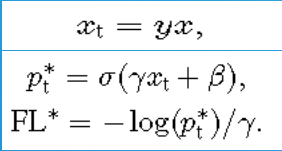

# Focal Loss for Dense Object Detection  
## 作者：Tsung-Yi Lin  Priya Goyal  Ross Girshick  Kaiming He  Piotr Dollar  

### 1、RatinaNet  
能否提出一个a single, unified network，兼顾one-stage的速度和two-stage的精度？  

网络结构图：  

   

注意：  
P6 is obtained via a 3\*3 stride-2 conv on C5, and P7 is computed by applying ReLU followed by a 3\*3 stride-2 conv on P6   
This differs slightly from :   
(1) we don’t use the high-resolution pyramid level P2 for computational reasons,   
(2) P6 is computed by strided convolution instead of downsampling,  
(3) we include P7 to improve large object detection.  
These minor modifications improve speed while maintaining accuracy  

网络结构：ResNet+FPN+two subnetworks(classification+regression)  
特点：特征提取能力强，特征融合、两个特定任务   

训练：  
常规设置训练：uses standard cross entropy (CE) loss without any
modifications to the initialization or learning strategy    
结果：fails quickly, with the network diverging during training    

为什么？   
新发现：Under such an initialization, in the presence of class imbalance,
the loss due to the frequent class can dominate total loss and cause instability in early training     
解决：introduce the concept of a ‘prior’ for the value of p estimated
by the model for the rare class (foreground) at the start of training.
All new conv layers except the final one in the RetinaNet subnets are initialized with bias b = 0 and a Gaussian weight fill with sigma = 0.01. For the final conv layer of the classification subnet, we set the bias initialization to b = -log((1-π)/π), where π specifies that at the start of training every anchor should be labeled as foreground with confidence of 0.01.     
结果：Training RetinaNet with ResNet-50 and this initialization already yields a respectable AP of 30.2 on COCO.    

一个重大发现：class imbalance    
原因：   
why call RantinaNet？  
We sweep over the number of scale and aspect ratio anchors used at each spatial position and each pyramid level in FPN   

input image size：600 pixels   
feature map：p3 p4 p5 p6 p7   
anchor：   
       第一次： a single square anchor      
               12 anchors per location spanning 4 sub-octave scales and 3 aspect ratios [0.5, 1, 2]    
               AP (30.3）  
        之后：3 scales and 3 aspect ratios per location    
                improved by nearly 4 points (to 34.0)  
结果： candidate object locations 约100K that densely cover spatial positions,scales, and aspect ratios.    

why two—stage not？   

address class imbalance through two mechanisms:  
(1) a two-stage cascade   
The first cascade stage is an object proposal mechanism that reduces the nearly infinite set of possible object locations down to one or two thousand. Importantly, the selected proposals are not random, but are likely to correspond to true object locations, which removes the vast majority of easy negatives.   
例如：   
R-CNN：Selective Search,2000个候选框划分正负样本   
faster R-CNN:RPN 2000 proposals，控制正负比1:3   

(2) biased minibatch sampling   
 When training the second stage, biased sampling is typically used to construct minibatches that contain, for instance, a 1:3 ratio of positive
to negative examples. This ratio is like an implicit α-balancing factor that is implemented via sampling.   
例如：  
OHEM：将原图的所有proposals扔到RoINet1，计算它们的loss，根据loss从高到低排序，以及利用NMS，来选出前K个proposals   

注意：模型的机制决定其优劣势   

影响：  
causes two problems:  
(1) training is inefficient as most locations are easy negatives that contribute no useful learning signal;  
(2) en masse,the easy negatives can overwhelm training and lead to degenerate models   

### 2、Focal Loss   
  

1、权重因子用于调节positive和negative的比例  
2、调整因子抑制easy example   

  

   

As can be seen, FL can effectively discount the effect of easy negatives,
focusing all attention on the hard negative examples  
原因：  
Easily classified negatives comprise the majority of the loss and dominate the gradient.   

  
# the exact form of the focal loss is not crucial
two properties of the focal loss:    
(1) When an example is misclassified and pt is small, the modulating factor is near 1 and the loss is unaffected. As pt→1, the factor goes to 0 and the loss for well-classified examples is down-weighted.   
(2) The focusing parameter smoothly adjusts the rate at which easy examples are downweighted.   
 
模型细节：  
1、FPN backbone：  
While many design choices are not crucial, we emphasize the use of the FPN backbone is; preliminary experiments using features from only the final ResNet layer yielded low AP.  

2、Anchors：  
The anchors have areas of 32\*32 to 512\*512 on pyramid levels P3 to P7;  
three aspect ratios {1:2; 1:1, 2:1};  
anchors of sizes {2^0,2^(1/3), 2^(2/3)}of the original set of 3 aspect ratio anchors.  
In total there are A = 9 anchors per level and across levels they cover the scale range 32-813 pixels with respect to the network’s input image.

intersection-over-union (IoU) threshold:  
0.5:ground-truth object boxes;  
[0, 0.4):background;  
[0.4, 0.5):ignored during training.  

3、Classification Subnet and Box Regression Subnet：  
相同结构，不共享参数；对FPN中每个层共享分类和回归网络   

4、Inference：  
at most 1k top-scoring predictions per FPN level, after thresholding
detector confidence at 0.05. The top predictions from all levels are merged and non-maximum suppression with a threshold of 0.5 is applied to yield the final detections.  

5、Focal loss：  
normalized by the number of anchors assigned to a ground-truth box  

6、 Initialization：  
All new conv layers except the final one in the RetinaNet subnets are initialized with bias b = 0 and a Gaussian weight fill with sigma = 0.01. For the final conv layer of the classification subnet, we set the bias initialization to b = -log((1-π)/π), where π specifies that at the start of training every anchor should be labeled as foreground with confidence of 0.01.  this initialization prevents the large number of background anchors from generating a large, destabilizing loss value in the first iteration of training.   

### Experiments   
   

1、lower α are selected for higher γ(as easy negatives are downweighted，less emphasis needs to be placed on the positives).   
α =0.25，γ=2时最优  
2、beyond 6-9 anchors did not shown further gains.  
3、This is a gap of 3.2 AP, showing FL is more effective than OHEM for training dense detectors.  

   

Larger backbone networks yield higher accuracy, but also slower inference speeds. Likewise for input image scale.  

  

### 3、思考  
为什么YOLO V3使用Focal loss无效？  
原文作者：  
it has separate objectness predictions and conditional class predictions.  
可能原因：  
1、特征图的大小与正负样本比  
2、anchor的设置   
proposal box：（52×52+26×26+13×13）×3=10647个  
 

 

                

