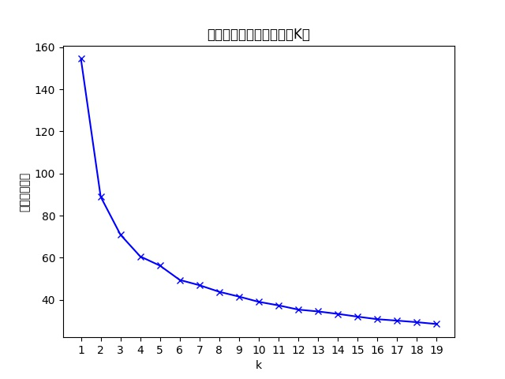
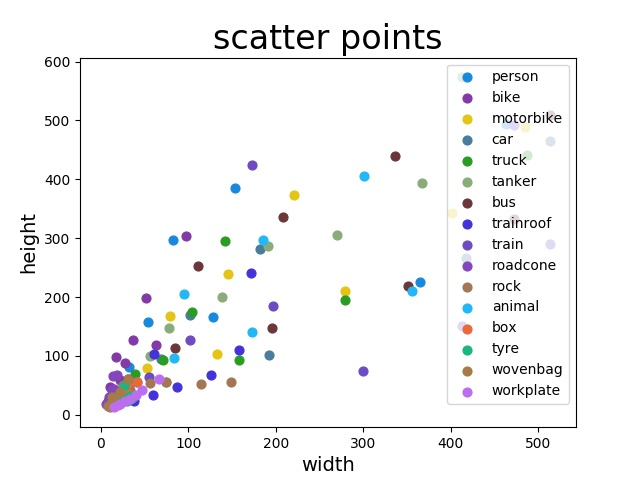
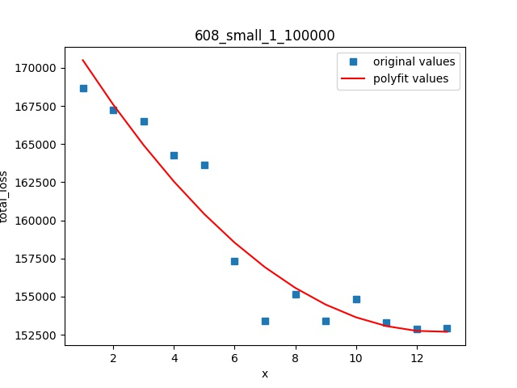
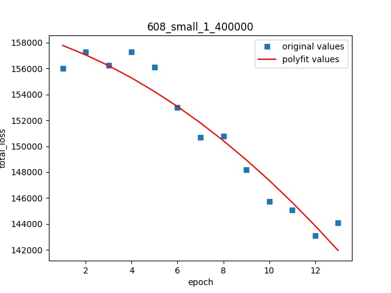

# Yolo训练框架   
   
# 1、对自有数据集做数据统计   

## 1.1 rgb均值统计     
[工具](yolo/examples/rgbstat.py)：yolo/examples/rgbstat.py   
详细使用方法见py文件内     
详细结果见[results](stat/readme.md)     

总体结果：    

|dataset|B_mean|B_std|G_mean|G_std|R_mean|R_std|   
|:-----:|:-----:|:-----:|:-----:|:-----:|:-----:|:-----:|  
|total|109.687 |12.265 |113.538 |9.712 |113.453 |10.142|   

## 1.2 大中小目标数量统计    
[工具](yolo/examples/areastat.py)：yolo/examples/areastat.py      
详细使用方法见py文件内    
详细结果见[results](stat/readme.md)   

总体结果：  

|dataset|picture number|large|medium|small| 
|:-----:|:-----:|:-----:|:-----:|:-----:|   
|total|204733|326229|322995|205343|  

## 1.3 anchor聚类    
### 1.3.1 统计每个目标的宽高   
[工具](yolo/examples/widthheightstat.py)：yolo/examples/widthheightstat.py    

详细使用方法见py文件内      
详细结果见程序生成文件     

### 1.3.2 确定Kmeans聚类的k     
[工具](yolo/examples/selectk.py)：yolo/examples/selectk.py        
详细使用方法见py文件内     
详细结果见[results](groupstat/readme.md)     
结果：     
       
说明：通过肘部法则可以得到，k大于6时，折线图的斜率明显变缓，所以k是转折点       

### 1.3.3 按照大中小聚类     
[工具](yolo/examples/groupkmeans.py)：yolo/examples/groupkmeans.py         
详细使用方法见py文件内     
详细结果见[results](groupstat/readme.md)     
结果：    
    

|total|width|height|aspectratio| 
|:-----:|:-----:|:-----:|:-----:| 
|anchor1| 8.848| 19.471| 0.454| 
|anchor2| 13.773| 47.169| 0.292| 
|anchor3|24.423|25.531|0.957| 
|anchor4|28.968| 66.585| 0.435| 
|anchor5|41.394|136.607| 0.303| 
|anchor6|72.63|70.075|1.036| 
|anchor7|106.089|209.975|0.505| 
|anchor8|201.761|373.161|0.541| 
|anchor9|435.909| 428.629| 1.017|   

### 1.3.4 按照大中小和目标类别聚类      
[工具](../groupstat/utils/somekmeans.py)     
详细使用方法见py文件内     
详细结果见[results](../groupstat/readme.md)    
结果：    
分辨率：608        

|total|width|height|aspectratio|
|:-----:|:-----:|:-----:|:-----:|
|allanchor1| 16.588| 43.849| 0.378|
|allanchor2| 14.097| 20.395| 0.691|
|allanchor3| 29.255| 25.287| 1.157|
|allanchor1| 48.011| 114.462| 0.419|
|allanchor2| 92.13| 58.468| 1.576|
|allanchor3| 35.094| 56.329| 0.623|
|allanchor1| 470.161| 428.497| 1.097|
|allanchor2| 136.916| 175.673| 0.779|
|allanchor3| 273.219| 301.169| 0.907| 

分辨率：416        

|total|width|height|aspectratio|
|:-----:|:-----:|:-----:|:-----:|
|allanchor1| 27.781| 22.171| 1.253|
|allanchor2| 17.417| 40.105| 0.434|
|allanchor3| 11.304| 16.919| 0.668|
|allanchor1| 34.366| 54.506| 0.63|
|allanchor2| 94.817| 50.587| 1.874|
|allanchor3| 54.03| 104.184| 0.519|
|allanchor1| 108.534| 177.034| 0.613|
|allanchor2| 296.038| 302.037| 0.98|  
|allanchor3| 233.642| 149.214| 1.566|     

# 2、训练及测试      
训练及测试参照腾讯优图yolov3 readme      

# 3、结果     
详细结果见[最新结果](anchor/last.md)   
详细结果见[中期结果](anchor/lastresults.md)   
详细结果见[古老版本结果](anchor/readme.md)   

训练参数：    
1、学习率：[400,700,900,1000, 40000,65000,80000，90000]，[0.0001,0.0002,0.0005,0.001, 0.0005,0.0001,0.00005,0.00001]（调整轮数设置，学习率设置）     
2、batchsize：24      
3、minibatch：6
 
说明：    
1、编号规则：anchor数量_训练分辨率_目标类别（例如：9_608_16，9个anchor的情况，训练分辨率为608，检测目标的类别为16类）   
2、darknet下cfg文件修改规范：    
如果anchor为9个，更改cfg文件:    
（1）需要更改yolo层的classes,更改为类别数   
（2）需要更改yolo层上一层的convolutional的filter的数量,为 (类别数+5)*3, 例如类别数为1, 则为18; 类别数为2则为21. (5是4个bbox的坐标加上一个置信度, 3是anchor的数量)   
如果anchor为6个，更改cfg文件:   
（1）需要更改yolo层的classes,更改为类别数   
（2）需要更改yolo层上一层的convolutional的filter的数量,为 (类别数+5)*2, 例如类别数为1, 则为12; 类别数为2则为14. (5是4个bbox的坐标加上一个置信度, 2是anchor的数量)   
（3）需要更改yolo层的num=6   

# 3.1 按照训练分辨率608设置的anchor   

## 1、 9个anchor的情况：        
anchor尺寸：[(15,18),  (16,28), (28,28),(36,54), (38,35), (63,90), (113,173), (223,392), (381,467)]      
训练轮数：400000（每次训100000）       

优图pytorch：   

|anchor|训练分辨率|测试分辨率|MAP| 
|:-----:|:-----:|:-----:|:-----:| 
|9_608_16| 608| 416| 0.439|  
|9_608_16| 608| 544| 0.5|  
|9_608_16| 608| 608| 0.512|   
|9_608_16| 608| 672| 0.524 |  

darknet原生框架下：    

|anchor|训练分辨率|测试分辨率|训练轮数|显卡情况|训练速度|MAP| 
|:-----:|:-----:|:-----:|:-----:| :-----:| :-----:|:-----:|
|9_608_16| 608| 608| 100000|双卡|约2.5h/10000轮|0.453 |
|9_608_16| 608| 608| 200000(续训)|双卡|约2h/10000轮|0.486 |
|9_608_16| 608| 608| 300000(续训)|双卡|约2h/10000轮|0.501 |

## 2、 6个anchor的情况：          
anchor尺寸：[(12,20),  (17,43), (39,64),(50,126), (119,236), (349,419)]     
训练轮数：300000（每次训100000）     

优图pytorch：   

|anchor|训练分辨率|测试分辨率|MAP| 
|:-----:|:-----:|:-----:|:-----:| 
|6_608_16 | 608| 416| 0.413|  
|6_608_16 | 608| 544| 0.479|  
|6_608_16 | 608| 608| 0.492|   
|6_608_16 | 608| 672| 0.498|

darknet原生框架下：  

|anchor|训练分辨率|测试分辨率|训练轮数|显卡情况|训练速度|MAP| 
|:-----:|:-----:|:-----:|:-----:| :-----:| :-----:|:-----:|
|6_608_16| 608| 608| 100000|双卡|约2h/10000轮|0.447 |

## 3、 针对person类anchor：            
anchor尺寸：[(8,20),  (13,51), (19,31),(26,75), (38,149), (61,85), (91,231), (183,384), (400,453)]      
训练轮数：100000      

优图pytorch：   

|anchor|训练分辨率|测试分辨率|训练轮数|MAP| 
|:-----:|:-----:|:-----:|:-----:| :-----:| 
|9p_608_16| 608| 608|100000|0.453 |
|9p_608_16| 608| 608|100000|0.497 |

说明：训练轮数极少的情况下达到的，还有提高空间     

darknet原生框架下：   
 
|anchor|训练分辨率|测试分辨率|训练轮数|显卡情况|训练速度|MAP| 
|:-----:|:-----:|:-----:|:-----:| :-----:| :-----:|:-----:|
|9p_608_16| 416| 416| 100000|单卡|约4h/10000轮|0.394 |
|9p_608_16| 608| 608| 100000|双卡|约2.5h/10000轮| 0.442| 

# 3.2 按照训练分辨率416设置的anchor

## 1、 9个anchor的情况：        
anchor尺寸：[(8,17),  (24,25), (13,44),(30,64), (42,133), (73,67), (89,200), (172,257), (318,298)]      
训练轮数：200000（每次训100000）       

优图pytorch：    

|anchor|训练分辨率|测试分辨率|训练轮数|MAP| 
|:-----:|:-----:|:-----:|:-----:| :-----:| 
|9_416_16| 416| 416| 100000|0.348|  
|9_416_16| 416| 416| 200000|0.397|

darknet原生框架下：   

|anchor|训练分辨率|测试分辨率|训练轮数|显卡情况|训练速度|MAP| 
|:-----:|:-----:|:-----:|:-----:| :-----:| :-----:|:-----:|
|9_416_16| 416| 416| 100000|双卡|约2h/10000轮| 0.395|

## 2、 6个anchor的情况：        
anchor尺寸：[(15,17), (21,36), (36,63),(82,76), (136,167), (296,277)]      
训练轮数：300000（每次训100000）        

优图pytorch：    

|anchor|训练分辨率|测试分辨率|训练轮数|MAP| 
|:-----:|:-----:|:-----:|:-----:| :-----:| 
|6_416_16 | 416| 416| 100000|0.34|  
|6_416_16 | 416| 416| 200000|0.404|
|6_416_16 | 416| 416| 300000|0.435|

darknet原生框架下：     

|anchor|训练分辨率|测试分辨率|训练轮数|显卡情况|训练速度|MAP| 
|:-----:|:-----:|:-----:|:-----:| :-----:| :-----:|:-----:|
|6_416_16 | 416| 416| 100000|单卡|约4h/10000轮| 0.398|
|6_416_16 | 416| 416| 200000(续训)|单卡|约4h/10000轮| 0.431|
|6_416_16 | 416| 416| 100000|双卡|约2h/10000轮|0.404|
|6_416_16 | 416| 416| 100000|三卡| 约1.5h/10000轮|0.405|

结论：多卡训练，相同轮数，精度略微提升，训练时间变为原来的1/显卡数     

## 3、 针对person类anchor：          
anchor尺寸：[(7,18),  (12,46), (20,31),(27,72), (38,144), (63,85), (87,227), (217,161), (234,334)]    
训练轮数：200000      

优图pytorch：   

|anchor|训练分辨率|测试分辨率|训练轮数|MAP| 
|:-----:|:-----:|:-----:|:-----:| :-----:| 
|9p_416_16 | 416| 416| 100000|0.35|  
|9p_416_16 | 416| 416| 200000|0.408|

darknet原生框架下：   

|anchor|训练分辨率|测试分辨率|训练轮数|显卡情况|训练速度|MAP| 
|:-----:|:-----:|:-----:|:-----:| :-----:| :-----:|:-----:|
|9p_416_16 | 416| 416| 100000|双卡|约2h/10000轮| 0.400|

# 4、loss分析   
[工具](../anchor/utils/lossanalysis.py)   
详细使用方法见py文件内       
详细结果见[loss结果](../anchor/lossanalysis.md)       
如图所示：      
情况一：      
        
说明：在第5个epoch时及时调整学习率可以让loss下降更快，但在12个epoch后loss就明显收敛了，此时需要调整学习率再训练         

情况二：       
         
说明：loss一直在下降，说明模型可以继续训练  

