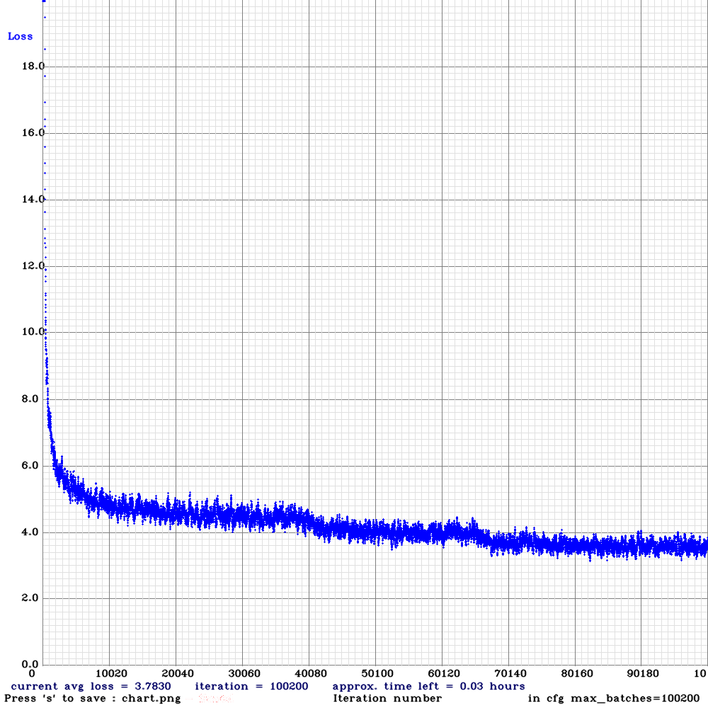
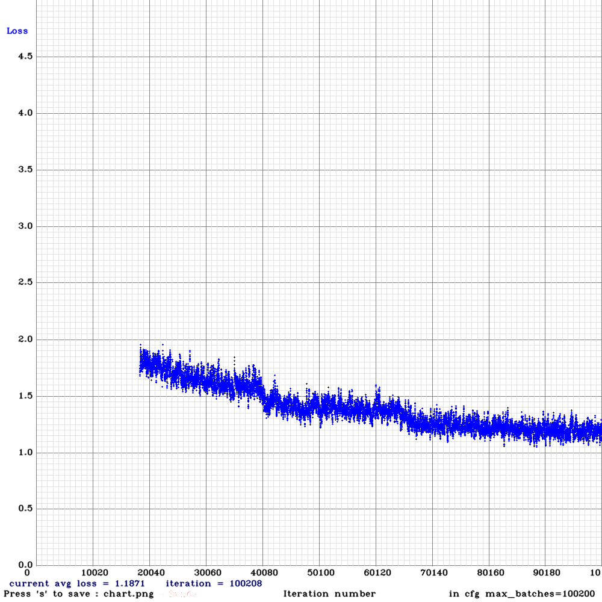

# Yolo v4

最先没有做任何改变，使用yolov4 train cfg,梯度爆炸；    
最后momentum从0.945调整到0.9，decay从0.0005调整到0.001，learning_rate从0.0013调整到0.001解决了梯度爆炸问题，并取得以下的结果：    

|anchor|训练分辨率|测试分辨率|训练轮数|显卡情况|训练速度|iou=0.5 MAP|MAP| 
|:-----:|:-----:|:-----:|:-----:| :-----:| :-----:|:-----:|:-----:|
|原生| 416| 416| 100000|四卡|约1h/10000轮|0.828 |0.518|
|原生| 416| 512| 100000|四卡|约1h/10000轮|0.844 |0.529|

## 训练loss图

# csdarknet53-panet-spp
|anchor|训练分辨率|测试分辨率|训练轮数|显卡情况|训练速度|iou=0.5 MAP|MAP| 
|:-----:|:-----:|:-----:|:-----:| :-----:| :-----:|:-----:|:-----:|
|原生| 416| 416| 100000|四卡|约1h15min/10000轮|0.756 |0.413|

## 训练loss图

# Yolo v3 decay

|anchor|训练分辨率|测试分辨率|训练轮数|iou=0.5 MAP|MAP| 
|:-----:|:-----:|:-----:|:-----:| :-----:| :-----:|-----:|
|原生| 416| 416| 100000|0.820 |0.461|
|原生| 416| 416| 100000|0.668 |0.316|
|原生| 416| 416| 100000|0.312 |0.115|
